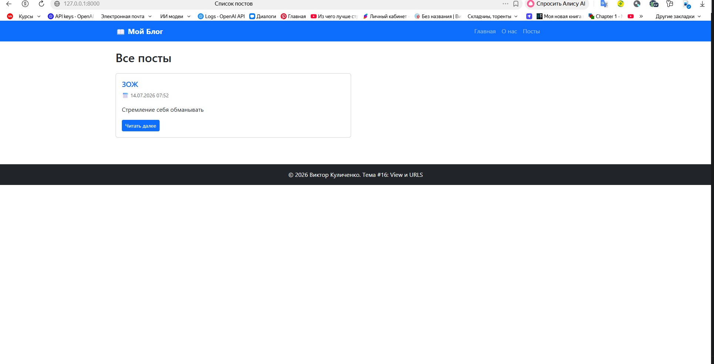
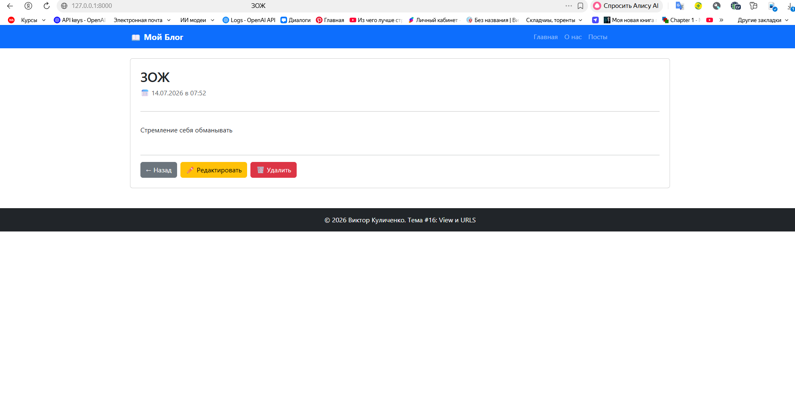
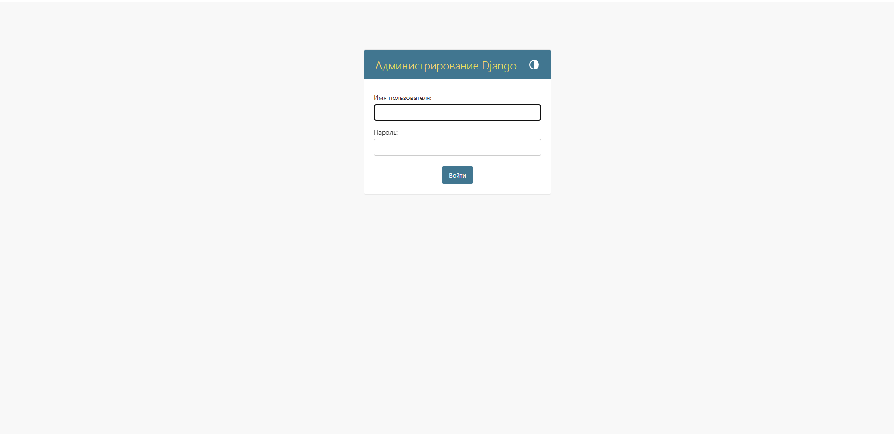

# 📖 MyBlog — Блог на Django (Тема #16: View и URLS)

Веб-приложение для ведения блога, демонстрирующее работу с **простыми и динамическими маршрутами**, **представлениями (Views)**, **формами с валидацией** и **шаблонами Django**.

## 👤 Автор
**Виктор Куличенко** — Специалист по ИБ | AI Security Expert  
📧 cocmosx@mail.ru | 📍 Санкт-Петербург  
💼 GitHub: [VictorKVS](https://github.com/VictorKVS)

---

## ✅ Выполненные требования ТЗ

### Основные требования:

| № | Требование | Реализация | Статус |
|---|-----------|------------|--------|
| 1 | **Статическая страница "/"** | `home.html` — приветствие и ссылки | ✅ |
| 2 | **Статическая страница "/about/"** | `about.html` — информация о проекте | ✅ |
| 3 | **Страница списка постов "/posts/"** | `PostListView` — кликабельные заголовки | ✅ |
| 4 | **Страница отдельного поста "/posts/{id}/"** | `PostDetailView` — динамический маршрут `<int:pk>` | ✅ |
| 5 | **Форма создания поста "/posts/create/"** | `PostCreateView` + `PostForm` | ✅ |
| 6 | **Обработка ошибок формы** | Валидация + отображение ошибок в шаблоне | ✅ |

### Обязательно к выполнению:

| № | Требование | Реализация | Статус |
|---|-----------|------------|--------|
| 1 | **CSS-стилизация** | Bootstrap 5 + `blog/static/blog/css/style.css` | ✅ |
| 2 | **Редактирование постов** | `PostUpdateView` → `/posts/<id>/update/` | ✅ |
| 3 | **Удаление постов** | `PostDeleteView` → `/posts/<id>/delete/` | ✅ |
| 4 | **Тесты** | 3 теста в `blog/tests.py` — все прошли OK | ✅ |

---

## 🏗️ Структура проекта

```text
DZ16_Views_URLs/
├── manage.py                    # Точка входа Django
├── db.sqlite3                   # База данных SQLite
├── requirements.txt             # Зависимости проекта
├── README.md                    # Описание проекта
│
├── myblog/                      # 📦 Django-ПРОЕКТ (настройки)
│   ├── settings.py              # ⚙️ Конфигурация (blog подключён)
│   ├── urls.py                  # 🔗 Главный роутер
│   ├── wsgi.py
│   └── asgi.py
│
└── blog/                        # 📦 Django-ПРИЛОЖЕНИЕ (логика блога)
    ├── models.py                # 📝 Модель Post (title, content, created_at)
    ├── views.py                 # 👁️ 7 представлений (home, about, List, Detail, Create, Update, Delete)
    ├── urls.py                  # 🔗 7 маршрутов приложения (app_name='blog')
    ├── forms.py                 # 📋 PostForm с валидацией и виджетами Bootstrap
    ├── admin.py                 # 🔐 Регистрация в админке
    ├── tests.py                 # 🧪 3 теста для проверки маршрутов
    │
    ├── templates/blog/          # 🎨 HTML-шаблоны
    │   ├── base.html            # Базовый шаблон (шапка, меню, футер)
    │   ├── home.html            # Главная страница (/)
    │   ├── about.html           # О нас (/about/)
    │   ├── post_list.html       # Список постов (/posts/)
    │   ├── post_detail.html     # Один пост (/posts/<id>/)
    │   ├── post_form.html       # Форма создания/редактирования
    │   └── post_confirm_delete.html # Подтверждение удаления
    │
    ├── static/blog/css/         # 💅 CSS-стили
    │   └── style.css
    │
    └── migrations/              # 🗄️ Миграции БД
        └── 0001_initial.py

🚀 Как запустить проект
1. Активируйте виртуальное окружение

cd "G:\1\Python-III\DZ16_Views_URLs"
.\venv\Scripts\activate

pip install -r requirements.txt

4. Создайте суперпользователя (для админки)

python manage.py createsuperuser

5. Запустите сервер

python manage.py runserver

6. Откройте в браузере
Главная страница: http://127.0.0.1:8000/
О нас: http://127.0.0.1:8000/about/
Список постов: http://127.0.0.1:8000/posts/
Создать пост: http://127.0.0.1:8000/posts/create/
Админка: http://127.0.0.1:8000/admin/

🧪 Запуск тестов

Found 3 test(s).
...
----------------------------------------------------------------------
Ran 3 tests in 0.072s
OK

🛠️ Технологии
Backend: Django 5.2, Python 3.10+
Frontend: HTML5, CSS3, Bootstrap 5
База данных: SQLite (по умолчанию)
Тестирование: Django TestCase
## 📸 Скриншоты работы приложения

### Главная страница


### Список постов


### Форма создания поста


### Админ-панель


💡 Ключевые технические решения
1. Динамические маршруты

# blog/urls.py
app_name = 'blog'

urlpatterns = [
    path('', views.home, name='home'),
    path('about/', views.about, name='about'),
    path('posts/', views.PostListView.as_view(), name='post_list'),
    path('posts/<int:pk>/', views.PostDetailView.as_view(), name='post_detail'),
    path('posts/create/', views.PostCreateView.as_view(), name='post_create'),
    path('posts/<int:pk>/update/', views.PostUpdateView.as_view(), name='post_update'),
    path('posts/<int:pk>/delete/', views.PostDeleteView.as_view(), name='post_delete'),
]


2. Модель Post

class Post(models.Model):
    title = models.CharField('Заголовок', max_length=100)
    content = models.TextField('Содержание')
    created_at = models.DateTimeField('Дата создания', auto_now_add=True)

3. Форма с валидацией

class PostForm(forms.ModelForm):
    class Meta:
        model = Post
        fields = ['title', 'content']
        widgets = {
            'title': forms.TextInput(attrs={'class': 'form-control'}),
            'content': forms.Textarea(attrs={'class': 'form-control', 'rows': 5}),
        }

4. Class-Based Views (CRUD)

class PostListView(ListView):
    model = Post
    template_name = 'blog/post_list.html'

class PostCreateView(CreateView):
    model = Post
    form_class = PostForm
    success_url = reverse_lazy('blog:post_list')

class PostUpdateView(UpdateView):
    model = Post
    form_class = PostForm

class PostDeleteView(DeleteView):
    model = Post
    success_url = reverse_lazy('blog:post_list')

5. Тесты

class BlogViewsTestCase(TestCase):
    def test_home_view(self):
        response = self.client.get(reverse('blog:home'))
        self.assertEqual(response.status_code, 200)

    def test_post_list_view(self):
        response = self.client.get(reverse('blog:post_list'))
        self.assertEqual(response.status_code, 200)

    def test_post_detail_view(self):
        response = self.client.get(reverse('blog:post_detail', kwargs={'pk': self.post.pk}))
        self.assertEqual(response.status_code, 200)


🎓 Чему я научился
✅ Создание Django-проектов и приложений
✅ Простые и динамические маршруты (path, <int:pk>)
✅ Function-Based Views (home, about)
✅ Class-Based Views (ListView, DetailView, CreateView, UpdateView, DeleteView)
✅ Полный CRUD (создание, чтение, обновление, удаление)
✅ Формы ModelForm с валидацией
✅ Обработка ошибок форм
✅ Наследование шаблонов (, )
✅ CSS-стилизация (Bootstrap 5 + кастомные стили)
✅ Тестирование с TestCase
✅ Пространства имён URL (app_name, reverse)
📝 Дата выполнения
Июль 2026 | Курс: Python-разработчик | Тема #16: View и URLS
🔗 Ссылки
Репозиторий: https://github.com/VictorKVS/DZ16_Views_URLs
GitHub автора: https://github.com/VictorKVS
